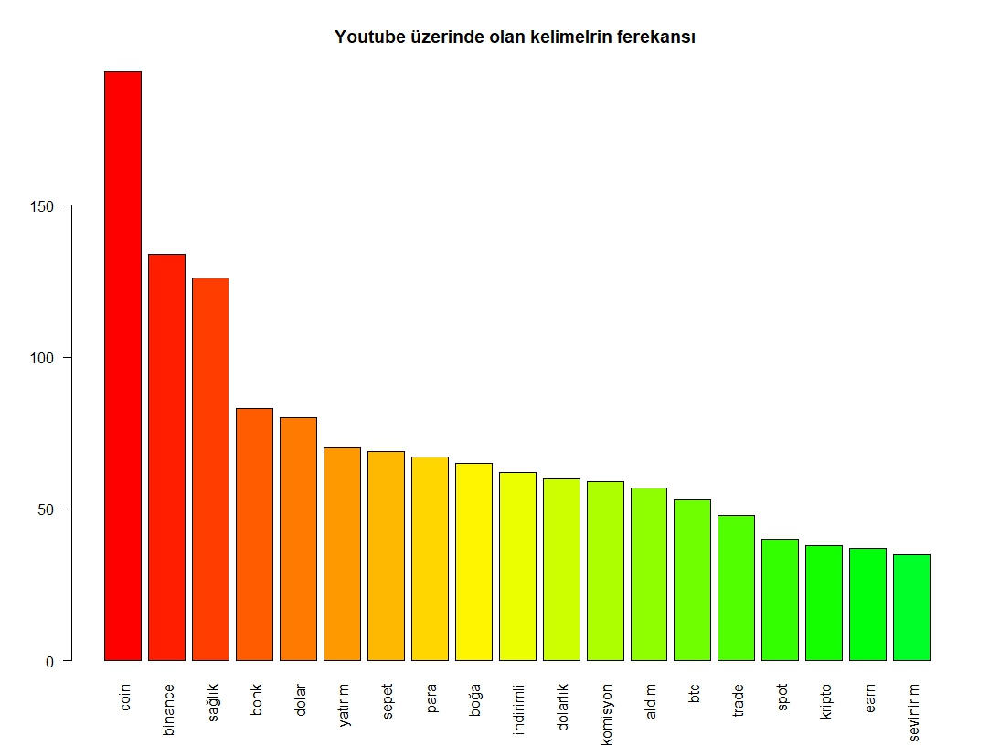

<div style="font-family:Times New Roman;font-size:20px">   

#  <p style="text-align:center;"> KRİPTO PARALAR </p>

  <p style="text-align:center;font-size:28px">Giriş<p> 


>Kripto para, dijital veya sanal bir varlık olarak bilinen, şifrelenmiş bir şekilde 
çalışan bir tür para birimidir. Kripto paralar, genellikle 
merkezi bir otoriteye “örneğin, hükümet veya banka gibi bir kuruluşa” bağlı olmayan, dağıtık bir ağ üzerinde çalışır. İşlemler, bu ağ üzerindeki bir dizi bilgisayar tarafından onaylanır ve kaydedilir. İlk ve en bilinen kripto para birimi Bitcoin'dir. Bu paraların tarihçesi oldukça kısa olsa da, bu alandaki hızlı evrim ve benimsenme, onları sadece finans dünyasını değil, aynı zamanda kültürel ve teknolojik alanları da etkileme potansiyeline sahip kılmıştır.
Bu Dijital paraların temeli, kriptografi uzmanı David Chaum'un 1983 yılında "Dijital Nakit" konseptini tanıttığı döneme kadar gitmektedir. Chaum'un önerisi, dijital ödemeleri gizlilik ve güvenliği artırmak amacıyla kriptografiyi kullanarak ele alıyordu. Ancak, kripto paraların öncüsü olarak kabul edilen Bitcoin, 2009 yılında Satoshi Nakamoto tarafından tanıtıldı ve bu dijital devrimin kapılarını ardına kadar açtı.
Bitcoin, merkezi bir otorite olmadan çalışan, güvenli ve şeffaf bir dijital para birimi olarak ortaya çıktı. İşlemleri kaydetmek için kullanılan blockchain teknolojisi, verilerin dağıtık bir ağda depolanmasını sağlayarak güvenliği artırır. Bu, herkesin ağa erişimi olduğu ve manipülasyonu zorlaştıran bir defter tutma yöntemi olarak öne çıktı. Bitcoin'in başarısının ardından birçok alternatif kripto para ortaya çıktı. Litecoin(2011), Ripple(2012), Cardano(2015) ve Polkadot(2020) gibi projeler de pazarda önemli bir yer edindi. Ethereum(2015), akıllı kontratlar gibi yenilikçi özellikler sunarak kripto paraların kullanım alanını genişletti.
---
  
###  <p style="text-align:center;color:red;"> `Bu analizi Reddit ve Youtube platformları üzerinden yapıldı.`<p>     
  
</div>

<div style="font-family:Times New Roman;">
  
- ## Metin madenciliği için gerekli paketler.

  ``` r
  if(!require(stringi)) install.packages("stringr")
  if(!require(stringr)) install.packages("stringi")
  if(!require(writexl)) install.packages("writexl")
  if(!require(readxl)) install.packages("readxl")
  if(!require(tidytext)) install.packages("tidytext")
  if(!require(dplyr)) install.packages("dplyr")
  if(!require(wordcloud2)) install.packages("wordcloud2")
  if(!require(ggplot2)) install.packages("ggplot2")
  if(!require(RColorBrewer)) install.packages("RColorBrewer")
  if(!require(stopwords)) install.packages("stopwords")
  if(!require(RedditExtractoR)) install.packages("RedditExtractorR")
  if(!require(tuber)) install.packages("tuber")
  if(!require(openxlsx)) install.packages("openxlsx")
  # Veri içerisinde kereksiz işaretler ve 
  # kelimereri kaldırmak için kendi oluşturduğumuz paket
  if(!require(StringRegex)) install.packages("StringRegex")

  library(StringRegex) #kendi oluşturduğumuz paket.
  library(openxlsx) #Excel dosyalarını okuma, yazma ve değiştirmek için kullanılır.
  library(stringr) #stringler üzerinde daha rahat çalişmak içindir.
  library(stringi) #geniş stringler üzerinde değişim veya düzenleme işlemi yapar.
  library(tm) #metin madenciliği ve analizi için kullanılır.
  library(writexl) #Excel dosyalarını doğrudan yazmaya yönelik işlevler sağlar.
  library(readxl) #Excel dosyalarını kolayca okumanıza olanak tanıyar.
  library(tidytext) #Düzenli veri ilkelerini kullanarak metin madenciliği ve analiz için kullanılır.
  library(dplyr) #Veri çerçeveleri üzerinde çalışan bir dizi işlev sağlayarak karmaşık veri işlemlerini ifade etmeyi kolaylaştırır.
  library(wordcloud2) #kelime Bulutu oluşturmak için kullanılır.
  library(ggplot2) #Animasyonlu ve etkileşimli veri görselleştirmeleri oluşturmak için kullanılır.
  library(RColorBrewer) #Grafiklerde ve görselleştirmelerde renkli hale getirmek için kullanılır.
  library(NLP) #bilgisayarlar ve insan dilleri arasındaki etkileşim kurmak için kullanılır.
  library(stopwords) #Gereksiz kelimeleri kaldırmak için kullanılır.
  library(syuzhet) #Çeşitli duygu analizi sözlüklerini kullanarak metinden duygu çıkarmak için kullanılır.
  ```
 
- ## Verilerdeki gereksiz karakterleri silmek ve büyük harfleri küçük harflere dönüştürmek , rakamları 		silmek için kullanacağımız fonksiyon.
  
  ```r
  #gereksiz işaretleri silme function
  replace_all <-function(input_string){
      
        #url kaldrimak
        input_string<- str_replace_all(input_string,"http[^[:space:]]*", "")
    
        # [#] ve [@] kaldirmak.
        input_string<- str_replace_all(input_string,"#\\S+", "")
        input_string<- str_replace_all(input_string,"@\\S+", "")
    
        # noktalama işaretlerin kaldırmka.
        input_string<- str_replace_all(input_string,"[[:punct:][:blank:]]+"," ")
      
        #büyük harfleri küçük harflere dönüştürmek.
        input_string<- str_to_lower(input_string,"tr")
    
        #rakamları silme.
        input_string<- removeNumbers(input_string)
                      
      #[ASCII] formatina uymayan karakterleri temizleme islemi yapiliyor
        input_string<- str_replace_all(input_string,"[<].*[>]"," ")
        input_string<- gsub("\uFFFD","",input_string,fixed = TRUE)
        input_string<- gsub("\n","",input_string,fixed = TRUE)
    
        #alfabetik olamyan harfleri temizleme islemi
        input_string<- str_replace_all(input_string,"[^[:alnum:]]", " ")

    return(input_string)
  } 
  ```

- ## Gereksiz kelimeleri silmek için kullanacağımız fonksion.
     
  ```r
    # gereksiz kelimeleri silme function
    removeVoca <-function(input_data,stopwords){
          input_data %>%
          #"text" id'yi değiştirerek "word" id'yi atamak
          unnest_tokens(word,text) %>%
          # eşleşen kelimeleri kaldıralaım.
          anti_join(stopwords,by="word")
    }
  ```                   
 
## `NOTE` : Yukarda olan bu iki fonksiyonlari "Reddit" ve "Youtube" uzerinde  kullanacağız.
 
 <p style="text-align:center;font-size:35px;"> REDDIT <p>

- ## Adım 1: Yorumlari almak için kullandığmız paket. 
  ```r
    if(!require(RedditExtractoR)) install.packages("RedditExtractorR")
    #redditden verileri çekmek için kullandığmiz paket
	library(RedditExtractoR)
  ```
  
- ## Adım 2: [#kriptopara] adı altında olan yorumları çekelim. Yorum sayısı 638
  ```r
    #toplam çekilen yorum sayısı 638
	hot_kripto <- find_thread_urls(subreddit = "kriptopara",sort_by ="hot",period = "day")
    reddit_text<- hot_kripto$title
  ```
- ## Düzenlenmemiş yorumların tablosu.
  </img>
  
- ## Adım 3 : Yorumuların içerisinde olan kereksiz karakter işaretlerini silelim. Bunun için kendi oluşturduğumz paket `StringRegex` içerisindeki `replace_all()`fonksiyonu kullanıyoruz.
  ```r
    #yorumuların içerisinde olan kereksiz işaretleri temizleme kodu
    reddit_text <-replace_all(reddit_text)

    #İşaretlerden temizlenmiş yorumları tabloya aktaralım
    Rdata <-data.frame(word=reddit_text)
  ```
- ## Adım 4: Düzenlenmiş yorumları Excele `.csv` formatında aktaralım.
  ```r
    #sonra excel tablosuna aktaralım
    write_xlsx(Rdata,"odev/REDDIT/Redditlexcion.csv")
  ```
 </img>

- ## Adım 5: Yroumlari tokenlere dönüştürmek ve onların ferekansalırnı almak için kullandığmız kod.
  ```r
    #karakter kümesine dönüştürelim
    corpus_reddit <- iconv(reddit_text,"UTF-8","UTF-8")

    #Corpus işlevini kullanarak bir derlem oluşturuyoruz
    corpus_reddit <- Corpus(VectorSource(corpus_reddit))

    #terim belge matrisi oluşturalım
    tdm <- TermDocumentMatrix(corpus_reddit) 

    #Terim-belge matrisini matrise dönüştürelim
    tdm <- as.matrix(tdm) 
    # sonra tokenleri oluşturalım
    words <- sort(rowSums(tdm),decreasing=TRUE) 

    # token tablosu oluşturuyoruz.
    create_tokens_R <-data.frame(text=names(words),n=words)
  ```
- ## Adım 6: Tokenlerin içerisindeki gereksiz kelimeler kaldıralım. Bunun için kendi oluşturduğumz paket `StringRegex` içerisindeki `removeVoce()`fonksiyonu kullanıyoruz.
  ```r
    #Tokenin içerisindeki gereksiz kelimeleri silelim
    clean_tokensR <-removeVoca(create_tokens_R,BreakWords)
    # son olarak reddit tokenlerimiz hazırdır.
    reddit_tokens <-data.frame(text=clean_tokensR$word,ferq=clean_tokensR$n)
  ```
  </img>

- ## Adım 7: Kelime bulutu oluşturuyoruz.
  ```r
    #kelime bulutu oluşturalım.
    wordcloud2(
      reddit_tokens,
      color = "random-dark",
      size = 1,
      shape = "hexagon"
    )
  ```
  </img>

- ## Adım 8 : Tokenler taplosunun içerisinde olan en çok ferekanslı kelimeleri alıp görselleştireceğiz.
  ```r
    get_plot <- reddit_tokens %>%
      filter(ferq >20) %>% #20 den büyük ferqansları alalım
      ggplot(aes(text,ferq,width=0.8))+geom_col() +
      xlab(NULL)+ylab(NULL) + coord_flip() +
      theme_minimal() + labs(title = "Reddit üzerinde en çok kullanılan kelimelerin görseli")
    get_plot
  ```
  </img>

- ## Adım 9: En çok ferekansıl olan tokenlrı sıralamak için kullandığmız kod.
  ```r
    #25 den buyuk olan ferekanslari ketir
    reddit_n <- subset(reddit_tokens$ferq,reddit_tokens$ferq>=20)

    #ferekansın index ile kelme tokenlerin indexsi eşit olacak.
    if(length(reddit_n)!=0){

      #index 0'dan başladığı için uzunlaukdan hep 1 çikar.
      reddit_text <-reddit_tokens$text[0:length(reddit_n-1)]

      barplot(reddit_n,main = "Reddit üzerinde olan kelimelrin ferekansı",las=3,names.arg = reddit_text,col = rainbow(40))
    }
  ```
  </img>

- ## Adım 10: Duygu analizi 
  ```r
    #reddit yorumlarını alalım
    R_lexcion <-read_xlsx("odev/REDDIT/Redditlexcion.csv")

    # yorumlari karakter haline cevirelim.
    commentsR <- iconv(R_lexcion$word,"UTF-8","UTF-8")

    #Yorum Sözlüğüne dayalı duygu puanlarını çıkarmak..
    point <-get_nrc_sentiment(commentsR)

    barplot(colSums(point),las=2,col = rainbow(15),
            ylab = "sayi",
            main = "reddit yorumlarındaki duygu puanıları"
    )
  ```
- ### Yroumlardakı duygu puanları.
  </img>

- ### Yroumlardakı duygu puanların grafik şekilinde.
  </img>

---

<p style="text-align:center;font-size:35px;"> YOUTUBE <p>

- ## Adım 1: kullanılan paket.
  ```r
    if(!require(tuber)) install.packages("tuber")
    #Youtube üzerinde verileri çekmek için kullanılan paket.
    library(tuber)
  ```

- ## Adım 2: Yorumlari almak için kulladığmız kod. Yorum sayısı 968.
  ```r
    #YOUTUBE: yorumları almak için kullandığımız paket.
    library(tuber)

    #youtube api alamak.
    client_id<- "************************************"
    client_secret <- "**********************************"
    yt_api <- yt_oauth(app_id=client_id,app_secret = client_secret,token = "")

    #toplam yorum sayısı --> 968

    search_comments1 <- get_all_comments("dU3uJUcvdbo")
    search_comments2 <-get_all_comments("rIfL2nT93dQ")
    search_comments3 <- get_all_comments("yGPmvZvGTWw")
    search_comments4 <-get_all_comments("sHfzKM8QVqY")
    search_comments5 <- get_all_comments("U1Q37HCYkxk")
    search_comments6 <- get_all_comments("wA6jW1NmTdM")

  ```
- ## Adım 3: Yorumları liste haline getirelim.
  ```r
    #yorumları liste haline getirelim.
    yt_text <- list(
      layer1=search_comments1$textDisplay,
      layer2=search_comments2$textDisplay,
      layer3=search_comments3$textDisplay,
      layer4=search_comments4$textDisplay,
      layer5=search_comments5$textDisplay,
      layer6=search_comments6$textDisplay
    )
  ```
- ## Düzenlenmemiş yorumların tablosu.
  </img>

- ## Adım 4: Yorumlari bir tablo halinde birleştirelim.
  ```r
    #yorumlari birleştirerek tabloda sutun haline getirelim.
    combinde_df <-cbind(
    text1=yt_text$layer1,
    text2=yt_text$layer2,
    text3=yt_text$layer3,
    text4=yt_text$layer4,
    text5=yt_text$layer5,
    text5=yt_text$layer6
    )

    #birleşmiş yorumları tabloda satır haline getirelim
    yt_comment_all <- data.frame(text=sprintf("%s",combinde_df))
  ```

- ## Adım 5: Yorumuların içerisinde olan kereksiz karakter işaretlerini silelim.Bunun için kendi oluşturduğumz paket `StringRegex` içerisindeki `replace_all()` fonksiyonu kullanıyoruz. Sonra Excele `.csv` formatında aktaralım.
  ```r
    #yorumuların çerisinde olan kereksiz işaretleri temizleyelim.
    yt_comment_all$text <-replace_all(yt_comment_all$text)

    Ydata <-data.frame(text=yt_comment_all$text)
    #veriyleri excele aktaralım.
    write_xlsx(Ydata,"odev/YOUTUBE/YoutubeLexcoin.csv")
  ```
  </img>

- ## Adım 6: Yroumlari tokenlere dönüştürmek ve onların ferekansalırnı almak için kullandığmız kod.
  ```r
  #Corpus işlevini kullanarak bir derlem oluşturuyoruz
    yt_docs <- Corpus(VectorSource(yt_comment_all$text))

    #Terim-belge matrisine dönüştürelim
    dtm_yt <- TermDocumentMatrix(yt_docs)

    #Terim-belge matrisini matrise dönüştürelim
    matrix_yt <- as.matrix(dtm_yt)

    # sonra tokenleri oluşturalım
    words_yt <- sort(rowSums(matrix_yt),decreasing=TRUE)

    # tokenleri tabloya aktaralım.
    create_tokens_Yt <- data.frame(text=names(words_yt),n=words_yt)
  ```

- ## Adım 7: Tokenlerin içerisindeki gereksiz kelimeler kaldıralım. Bunun için kendi oluşturduğumz paket `StringRegex` içerisindeki `removeVoce()` fonksiyonu kullanıyoruz.
  ```r
    #Tokenin içerisindeki gereksiz kelimeleri silelim
    clean_tokensY <-removeVoca(create_tokens_Yt,BreakWords)
    
    # duzenlenms tokeni alalim
    youtube_tokens <-data.frame(text=clean_tokensY$word,ferq=clean_tokensY$n)
  ```
  </img>

- ## Adım 8: Kelime bulutu oluşturuyoruz.
  ```r
    #kelime bulutu.
    wordcloud2(data = youtube_tokens,
      size = 1,
      color = "random-dark",
      shape="hexagon"
    )
  ```
  </img>

- ## Adım 9 : Tokenler taplosunun içerisinde olan en çok ferekanslı kelimeleri alıp görselleştireceğiz.
  ```r
    #Tokenler taplosunun içerisinde olan en çok ferekanslı kelimeleri alıp görselleştireceğiz.
    get_freq_yt <- youtube_tokens %>%
      filter(ferq >30) %>% #20 den büyük ferqansları alalım
      ggplot(aes(text,ferq,width=0.7))+geom_col() +
      xlab(NULL)+ylab(NULL) + coord_flip() +
      theme_minimal() + labs(title = "Youtube üzerinden en çok kullanılan kelimelerin görseli")
    get_freq_yt
  ```
  </img>

- ## Adım 10: En çok ferekansıl olan tokenlrı sıralamak için kullandığmız kod.
  ```r
    # 35 den buyuk olan ferekanslari ketir
    youtube_n <- subset(youtube_tokens$ferq,youtube_tokens$ferq>=35)

    if(length(youtube_n)!=0){

      #index 0'dan başladığı için uzunlaukdan hep 1 çikar.
      youtbe_text <-youtube_tokens$text[0:length(youtube_n-1)]
      barplot(height = youtube_n,main = "Youtube üzerinde olan kelimelrin ferekansı",names.arg = youtbe_text,las=2,col = rainbow(50))

    }
  ```
  </img>

- ## Adım 11: Duygu analizi.
  ```r
  #yorumlarini alalım
    yt_lexcion <-read_xlsx("odev/YOUTUBE/YoutubeLexcoin.csv")

    # yorumlari karakter haline cevirelim.
    commentsYt <-iconv(yt_lexcion$text,"UTF-8","UTF-8")

    #Yorum Sözlüğüne dayalı duygu puanlarını çıkarmak.
    nrc_y <-get_nrc_sentiment(commentsYt)

    # Yorumların Duygu puanların görselleştirelim
    barplot(colSums(nrc_y),las=3,col = rainbow(40),
            ylab = "sayi",
            main = "youtube uzerinde duygu analizi"
    ) 
  ```
- ### Yroumlardakı duygu puanları.
 </img>

- ### Yroumlardakı duygu puanların grafik şekilinde.
 </img>

- ## Reddit ve Youtube yorumlarını birleştirerek duygu analizi yapalım.
  ```r
    # verileri oluşturduğmuz dosyanın uzerine yazacağız
    file1 <- file2 <-loadWorkbook("odev/RedditAndYoutube.xlsx")

    writeData(file1,sheet = "Sheet 1",x=R_lexcion$word,startRow = 1,startCol = 1)

    writeData(file2,sheet = "Sheet 1",x=yt_lexcion$text,startRow = 639,startCol = 1)

    saveWorkbook(file1,"odev/RedditAndYoutube.xlsx",overwrite = T)
    saveWorkbook(file2,"odev/RedditAndYoutube.xlsx",overwrite = T)

  ```
  </img>

- ## Duygu analizi. 
  ```r
    # en sonda duygu analiz 
    redditAndyoutube <-read_xlsx("odev/RedditAndYoutube.xlsx")

    # tokenleri alalım
    tokens <- data.frame(text=redditAndyoutube$text)

    #yorumların negativ,positiv olduğunu belirliyelim.
    sentimet <- tokens %>%
      unnest_tokens(word,text) %>%
      inner_join(get_sentiments("bing"),by="word") %>% 
      count(sentiment) %>% 
      spread(sentiment,n,fill = 0) %>%
      mutate(sentiment=positive+negative)#negativ,positiv yorumlarin toplamı


    #verileri grafike aktaralım
    barplot(colSums(sentiment),las=1,col = rainbow(40),
            ylab = "sayi",
            main = "Duygu analizi"
    )
  ```
- ### Duygu puanları.
  </img>

- ### Grafik formatında.
  </img>

</div>

---

> <p style="font-size:35px"> Kaynaklar </p>

-  [tidytextmining.com](https://www.tidytextmining.com/sentiment)
-  [r-bloggers.com](https://www.r-bloggers.com/2021/05/sentiment-analysis-in-r-3/)
-  [analytics-tuts.com](https://www.analytics-tuts.com/overwrite-or-append-data-in-excel-sheet-using-r/)
-  [guslipkin.medium.com](https://guslipkin.medium.com/making-pretty-excel-files-in-r-46a15c7a2ee8)
-  [stackoverflow.com](https://stackoverflow.com/questions/34643888/how-do-i-append-data-from-a-data-frame-in-r-to-an-excel-sheet-that-already-exist)
-  [kaggle.com](https://www.kaggle.com/code/rtatman/tutorial-sentiment-analysis-in-r)
 
